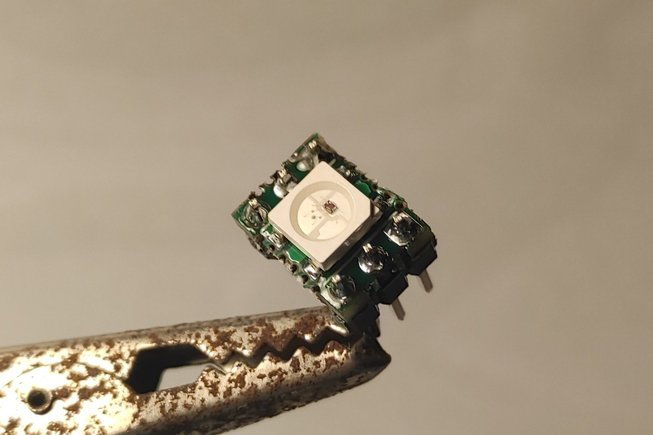
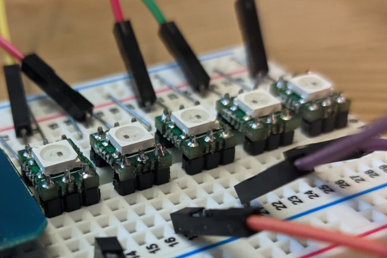

# BREADLED
[buy premade boards here!](https://www.tindie.com/products/25237/)

BREADLED is a breakout board for WS2812 addressable LEDs, designed to fit perfectly into common breadboards and perfboard without taking up an excessive amount of space.

